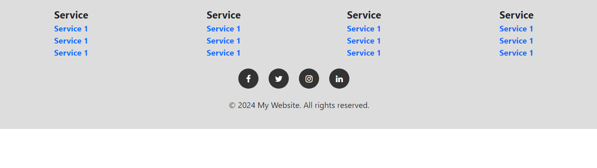

# Dynamic Footer with Current Year

This project implements a simple footer that automatically updates the copyright year using JavaScript. The year is dynamically generated based on the system's current date, ensuring that it remains accurate without requiring manual updates.

## Features
- Automatically updates the copyright year to the current year.
- Simple implementation using HTML and JavaScript.
- Easily adaptable for any website.

## Installation

1. Clone the repository or copy the code to your project.
2. Add the HTML and JavaScript code to the appropriate section of your website.

### HTML Structure

```html
<p>&copy; <span id="year"></span> My Website. All rights reserved.</p>

### OUTPUT 

