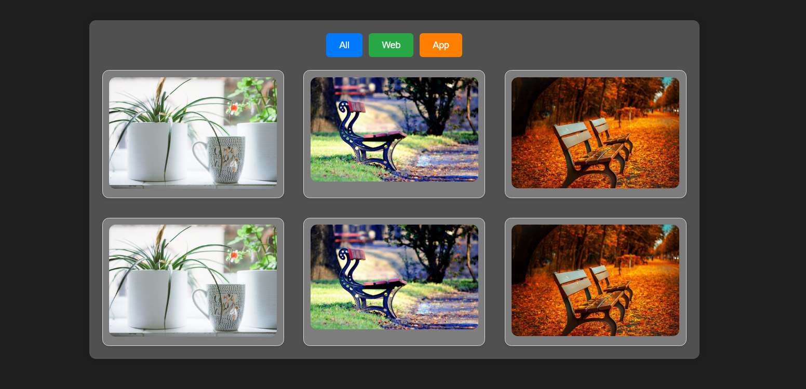

# Project Card

A simple project card component that displays information such as the project name, code, and relevant links. The project also includes filtering options by category (e.g., app, web project, or others), making it easy to browse and categorize various projects.

## Features

- Responsive design for various screen sizes.
- Hover effects for better user interaction.
- Display project name, description, and external links.
- Filter projects based on categories (e.g., App, Web Project, Other).
- Easy to integrate into any web project.

## Screenshots

## Tech Stack

- **HTML** - Structure of the card and filters.
- **CSS** - Styling and layout of the card and filters.
- **JavaScript** - Adding interactivity for filtering and card animations.

